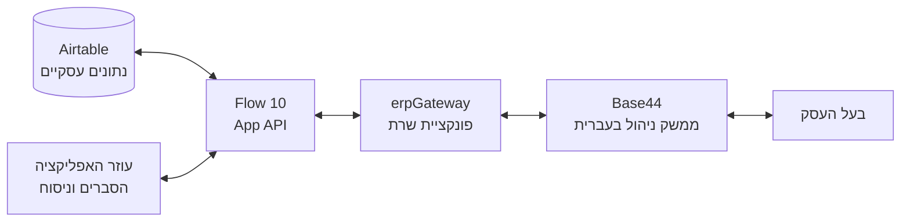
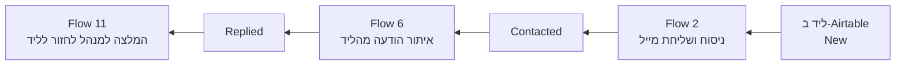
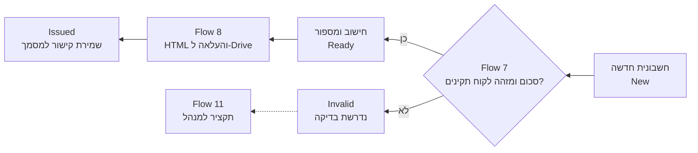

<div dir="rtl">

<h1 align="center">מצפן ERP</h1>
<p align="center"><strong>Kobi ERP · AI &amp; Automation</strong></p>
<p align="center">מהנתון העסקי, דרך האוטומציה, ועד ההחלטה של המנהל.</p>
<p align="center"><strong>11 תהליכי n8n</strong> · <strong>6 טבלאות עסקיות</strong> · <strong>2 בוטי Telegram</strong> · <strong>ממשק ניהול בעברית</strong></p>
<p align="center">אפיון, התאמה, אינטגרציה ובדיקות: <strong>קובי יעקב</strong><br>פרויקט גמר בקורס מיישם AI ואוטומציה, ג׳ון ברייס</p>

---

**מצפן ERP היא מערכת ניהול פנימית לעסק אלקטרוניקה ישראלי דמיוני.** היא מחברת ניהול לידים, לקוחות, הזמנות, מוצרים, חשבוניות ומשימות עם אוטומציות מכירה, שירות לקוחות מבוסס ידע ועוזר ניהולי. בעל העסק עובד בממשק אחד בעברית; מאחורי המסך, n8n מפעיל את התהליכים ו-Airtable מחזיק את הנתונים העסקיים.

הפרויקט מדגים **מערכת משולבת**, ולא רק אוסף מסכים או שיחה עם מודל: ליד נשמר, מייל נשלח, תגובה מזוהה, סטטוס משתנה ופריט לטיפול מגיע למנהל. במקביל, מסלול החשבוניות מייצר מסמך ושומר את הקישור שלו באפליקציה.

> **היקף הגרסה:** אב־טיפוס לימודי עם אינטגרציות חיות ותרחישים שנבדקו במהלך הפיתוח. המסמכים הכספיים הם מסמכי דמו, לא מערכת חשבונאית מאושרת. בדיקות ההדגמה אינן תחליף לבדיקות אבטחה, עומסים או התאמה לשימוש עסקי.

<p align="center">
<a href="#product">המוצר</a> ·
<a href="#architecture">ארכיטקטורה</a> ·
<a href="#workflows">11 התהליכים</a> ·
<a href="#data-model">מודל הנתונים</a> ·
<a href="#api">ממשק API</a> ·
<a href="#validation">בדיקות</a> ·
<a href="#setup">הקמה</a> ·
<a href="#demo">הדגמה</a> ·
<a href="#boundaries">מגבלות והמשך</a>
</p>

<a name="product"></a>

## 01 · מה המערכת מאפשרת לעשות?

**לראות את העסק.** דשבורד, טבלאות, חיפוש וסינון מציגים את הנתונים שנשמרו ב-Airtable: לידים לפי סטטוס, מסמכים שהופקו, מוצרים וזמינותם, לקוחות, הזמנות ומשימות.

**להפעיל תהליכים.** טפסים בממשק יוצרים רשומות דרך השרת ו-n8n. תהליכים מתוזמנים מטפלים בפניות מכירה, בתשובות ובמסמכי חשבוניות, לפי הסטטוסים בטבלאות.

**לשאול שאלות בהקשר הנכון.** בוט השירות מחפש במסמכי מדיניות ובקטלוג; בוט המנהל מחפש בטבלאות עסקיות; הצ׳אט באפליקציה מסביר תהליכים ומסייע בניסוח. אלה שלושה ערוצים שונים, עם יכולות שונות.

**לדעת מה דורש טיפול.** מרכז הטיפול מציג פריטים לפי כללים עסקיים. Flow 11 מוסיף תקציר יזום לבוט המנהל: מה נמצא, למה כדאי להתייחס אליו ומה הפעולה המומלצת.

### מסכי האפליקציה

| מסך | שימוש מרכזי |
| :--- | :--- |
| דשבורד | תמונת מצב המבוססת על רשומות עסקיות, ללא ספירת שורות ריקות |
| לידים | הצגה, חיפוש, סינון, יצירה ועריכת פרטי ליד |
| לקוחות | ניהול פרטי לקוח וסטטוס פעילות |
| הזמנות | הצגה ויצירת הזמנה עם מספר, מזהה לקוח וסכום |
| מוצרים | קטלוג, קטגוריות, מחירים, תיאור וזמינות במלאי |
| חשבוניות | נתוני המסמך, סטטוס תהליך וקישור לקובץ ב-Drive |
| משימות | עבודה פתוחה והושלמה, עם אפשרות לתעד הקשר ללקוח |
| מרכז טיפול | ריכוז מצבים שדורשים תשומת לב לפי כללים מוגדרים |
| צ׳אט עם הסוכן | הסברים וניסוח דרך מסלול `chat` של Flow 10 |
| הגדרות וחיבור | פרטי המשתמש המחובר ומצב החיבור למערכת |

האפליקציה מיועדת **לבעל העסק**, לא ללקוח חיצוני. טופס ״ליד חדש״ הוא טופס פנימי. אתר שיווקי, חנות מקוונת ועמוד נחיתה ציבורי אינם חלק מהמימוש המתועד כאן.

<a name="architecture"></a>

## 02 · ארכיטקטורה: ממשק, לוגיקה ונתונים

ההפרדה בין השכבות מאפשרת לשנות מסך בלי לשכפל את האוטומציה, ולשנות תהליך בלי להקים מסד נתונים נוסף.

| שכבה | טכנולוגיה | אחריות |
| :--- | :--- | :--- |
| ממשק ואימות משתמש | Base44 | מסכי הניהול, טפסים וצ׳אט בעברית וב-RTL |
| שער שרת | `erpGateway` ב-Base44 | העברת בקשות ל-n8n, מיפוי ישויות וטיפול בתשובות; שימוש בהגדרות שרת |
| תהליכים ואינטגרציות | n8n Cloud | ניתוב, קריאה וכתיבה, תזמונים, סוכנים והפקת מסמכים |
| נתונים עסקיים | Airtable | מקור הנתונים של שש הטבלאות |
| ידע לחיפוש סמנטי | Simple Vector Store | מאגרי המדיניות והמוצרים המשמשים את בוט השירות |
| שירותי תקשורת וקבצים | Gmail, Telegram, Google Drive | מיילים, הודעות ומסמכי חשבוניות |
| מודלי שפה ו-Embeddings | OpenAI דרך החיבורים המוגדרים ב-n8n | ניסוח, הפעלת כלי סוכן וייצוג טקסט לחיפוש |

<div dir="ltr">



</div>

**העיקרון:** הדפדפן אינו מחזיק את פרטי ההתחברות ל-Airtable ואינו צריך לקבל את הסוד המשותף ל-n8n. הבקשה עוברת דרך פונקציית השרת, ו-Flow 10 פונה לשירות המתאים.

לצד המסלול הזה פועלים תהליכים עצמאיים: מיילי מכירות, בוטי Telegram, טעינת RAG והפקת חשבוניות. הם משתפים נתונים דרך Airtable או דרך מאגרי הידע; לא כל Flow מפעיל ישירות את ה-Flow הבא.

### שני מסלולים להזנת ליד

**Flow 1** הוא מסלול Webhook ייעודי לקליטת ליד ולבדיקת כפילות לפי אימייל. **Flow 10** הוא המסלול שבו משתמשים טפסי Base44 לצורך פעולות ניהול. אין להניח שטופס Base44 מפעיל אוטומטית גם את Flow 1: מניעת כפילויות צריכה להיבדק בכל מסלול שמאפשר יצירה.

<a name="workflows"></a>

## 03 · מפת 11 התהליכים

המספור הבא הוא של **מימוש Kobi ERP**. הוא אינו בהכרח זהה למספור קובצי הדוגמה בקורס. התדירויות מתארות את ההגדרות בתהליכים; הפעלה אוטומטית תלויה בפרסום התהליך ובחיבורים תקינים.

| Flow | תהליך | הפעלה | תוצאה מרכזית |
| :---: | :--- | :--- | :--- |
| 01 | Leads Intake | בקשת Webhook | ליד חדש או הימנעות מיצירה חוזרת במסלול זה |
| 02 | Sales Cold Emails | כל 3 שעות | מייל מכירה וסטטוס `Contacted` |
| 03 | Policies Embedding | העלאת קובץ בטופס | ידע מדיניות לחיפוש סמנטי |
| 04 | Products Embedding | העלאת CSV בטופס | ידע מוצרים לחיפוש סמנטי |
| 05 | Customer Service Agent | הודעה לבוט השירות | תשובה בעזרת מאגרי ה-RAG |
| 06 | Sales Reply Checker | כל 30 דקות | זיהוי הודעה משולח מתאים ועדכון `Replied` |
| 07 | Invoice Validation | כל דקה | בדיקת נתונים, חישוב ומספור; `Ready` או `Invalid` |
| 08 | Invoice Maker + Drive | כל דקה | מסמך HTML ב-Drive, קישור וסטטוס `Issued` |
| 09 | Manager Agent | הודעה לבוט המנהל | תשובה בעזרת כלי קריאה ב-Airtable |
| 10 | App API | בקשת POST מהממשק | `read`, `create`, `update` או `chat` |
| 11 | Smart Treatment Center | כל שעה | תקציר טיפול למנהל לפי כללים עסקיים |

### מסלול המכירה בקצרה

<div dir="ltr">



</div>

המעבר ל-`Replied` מציין שנמצאה הודעה לפי כללי הזיהוי. הוא אינו מעיד לבדו על כוונת רכישה, סגירת עסקה או תשלום.

### פירוט התהליכים

<details>
<summary><strong>01 · קליטת לידים ובדיקת כפילות</strong></summary>

**מטרה:** לקבל פרטי פנייה וליצור ליד רק כאשר לא נמצאה רשומה מתאימה לפי האימייל.

בקשת POST נכנסת ל-Webhook עם פרטי הליד. צומת החיפוש בודק את `Email` בטבלת `Leads`, וצומת תנאי בודק אם התקבל מזהה רשומה. כשאין התאמה, נוצרת רשומה עם שם, אימייל, טלפון ו-`Status = New`. כשיש התאמה, מסלול היצירה אינו מופעל.

**צמתים מרכזיים:** `Webhook`, `Search records`, `If`, `Create a record`.

זו בדיקת כפילות יישומית, לא אילוץ ייחודיות אטומי במסד הנתונים. אין להסיק ממנה הגנה מלאה מפני שתי בקשות בו־זמניות או מפני יצירה במסלול אחר. תצורת הקליטה אינה כשלעצמה עמוד נחיתה ציבורי.

</details>

<details>
<summary><strong>02 · מיילי מכירה שנכתבים באמצעות AI</strong></summary>

**מטרה:** להפוך רשימת לידים חדשים לפניות מכירה מותאמות.

התהליך מאתר לידים בסטטוס `New`, מעביר את פרטי הליד למודל לצורך ניסוח בעברית ושולח את התוכן באמצעות Gmail. במסלול ההצלחה, `Mark Contacted` מעדכן את **רשומת הליד המקורית** ל-`Contacted`.

**צמתים מרכזיים:** `Every 3 Hours`, `Search New Leads`, `Write Cold Email`, `Send Email`, `Mark Contacted`.

ה-AI אחראי לניסוח. בחירת הרשומות והעדכון מתבצעים באמצעות צמתי העבודה. סטטוס `Contacted` מצמצם שליחה חוזרת ללידים שכבר טופלו, אך אינו מהווה מנגנון הבטחת שליחה יחידה בכל מצב של תקלה.

**בבדיקות משתמשים רק בכתובות שבשליטת הבודק.** פרסום התהליך מפעיל שליחת מיילים אמיתית; אין להכניס כתובות אקראיות לנתוני הדגמה.

</details>

<details>
<summary><strong>03 · בניית מאגר הידע למדיניות</strong></summary>

**מטרה:** לאפשר לבוט השירות למצוא מידע במסמכי העסק לפני ניסוח תשובה.

קובץ מדיניות מועלה דרך טופס n8n. `Load Documents` קורא את התוכן, ומודל Embeddings ממיר את מקטעי הטקסט לייצוגים המשמשים לחיפוש סמנטי. התוכן והייצוגים נטענים ל-`Simple Vector Store` תחת מפתח מאגר ייעודי למדיניות.

**צמתים מרכזיים:** `On form submission`, `Load Documents`, `Embeddings`, `Simple Vector Store`.

בגרסת ההדגמה נבדקה טעינה של מסמך מדיניות. היכולת לענות על נושא תלויה במסמכים שנטענו בפועל, ולא רק בקיום ה-Flow. עדכון המסמך מחייב רענון מבוקר של המאגר; אין לטעון שוב ושוב בלי לבדוק הצטברות כפילויות.

</details>

<details>
<summary><strong>04 · בניית מאגר הידע למוצרים</strong></summary>

**מטרה:** לספק לבוט השירות ידע על המוצרים מתוך קטלוג CSV.

הטופס מקבל CSV, טוען המסמכים מוגדר לקריאת CSV, ו-`Split Text` מחלק תוכן למקטעים. בתצורה שסופקה הוגדרו גודל מקטע `800` וחפיפה `100`. לאחר יצירת Embeddings, הנתונים נשמרים במאגר המוצרים.

**צמתים מרכזיים:** `On form submission`, `Load Documents`, `Split Text`, `Embeddings`, `Simple Vector Store`.

**הבחנה חשובה:** ה-Flow ממלא את מאגר ה-RAG, לא את טבלת `Products` ב-Airtable. במהלך הפרויקט הקטלוג יובא בנפרד גם ל-Airtable כדי שיופיע בממשק. שינוי מחיר או זמינות בטבלה אינו מסנכרן אוטומטית את מאגר הידע של הבוט.

</details>

<details>
<summary><strong>05 · סוכן שירות לקוחות עם RAG</strong></summary>

**מטרה:** לאפשר ללקוח לשאול שאלות בטלגרם על מדיניות ומוצרים.

הודעה נכנסת דרך `Telegram Trigger` לסוכן שירות הלקוחות. לרשותו מודל שפה ושני כלי חיפוש: `Policies Vector Store` ו-`Products Vector Store`. כאשר נדרש ידע עסקי, הסוכן יכול להפעיל את הכלי הרלוונטי ולהשתמש בתוצאות לניסוח תשובה. `Reply to Customer` מחזיר אותה לשיחה שממנה התקבלה הפנייה.

**דוגמאות שהודגמו:** שאלה על מדיניות החזרות ושאלה על מוצרים בתחום האוזניות, עם הפעלת כלי החיפוש הרלוונטיים.

RAG מחבר את התשובה למקורות שהוזנו, אך אינו מבטיח שכל תשובה תהיה נכונה. יש לבדוק את תוכן השליפה, את עדכניות הקטלוג ואת התנהגות הסוכן כשאין מידע מתאים.

</details>

<details>
<summary><strong>06 · איתור תגובות למיילי המכירות</strong></summary>

**מטרה:** לסמן למנהל שליד שכבר קיבל פנייה חזר עם הודעה.

התהליך קורא הודעות Gmail אחרונות, מחלץ את כתובת השולח ומחפש ליד תואם בסטטוס `Contacted`. כשנמצאת התאמה, `Mark Replied` מעדכן את רשומת הליד ל-`Replied`.

**צמתים מרכזיים:** `Every 30 Minutes`, `Get Recent Replies`, `Find Contacted Lead`, `Mark Replied`.

בתצורה שסופקה החיפוש מוגבל להודעות מהשבוע האחרון ולעד עשר הודעות בהרצה. הזיהוי מבוסס על כתובת השולח והסטטוס, **לא על אימות מלא של שרשור Gmail או ניתוח כוונת ההודעה**. התאמה לשרשור המקורי, תשובות אוטומטיות וטיפול בנפח הודעות גדול הם הרחבות להמשך.

</details>

<details>
<summary><strong>07 · אימות חשבונית, חישוב ומספור</strong></summary>

**מטרה:** להעביר רשומת חשבונית חדשה למצב מוכן להפקת מסמך, או לסמן אותה לבדיקה.

הגרסה שנבדקה מחפשת רשומה ב-`Status = New`. היא בודקת שסכום `Amount` גדול מאפס וש-`CustomerId` אינו ריק. במסלול התקין היא מאתרת את מספר החשבונית האחרון, מחשבת את המספר הבא, את `VatAmount` ואת `Total`, ומעדכנת ל-`Ready`. במסלול הלא תקין היא מעדכנת ל-`Invalid`.

**צמתים מרכזיים:** `Find Pending Invoice`, `Validate Invoice`, `Find Last Invoice Number`, `Calculate VAT & Number`, `Mark Ready`, `Mark Invalid`.

בדיקת ההדגמה עם סכום `1,000` הניבה `VatAmount = 180`, סכום כולל `1,180` ומספר `INV-0001`. אלה נתוני דמו בהתאם להגדרת החישוב, ולא אישור חשבונאי.

החישובים מפנים לנתונים בתוך `fields`, ואינם מסתמכים על שדה אחר שנוצר באותו צומת Set. האימות של `CustomerId` כאן הוא בדיקת נוכחות בלבד; הוא אינו מוכיח שקיימת רשומת לקוח תואמת. מספור תחת הרצות מקבילות דורש מנגנון נוסף.

</details>

<details>
<summary><strong>08 · הפקת מסמך חשבונית ושמירתו ב-Drive</strong></summary>

**מטרה:** להפוך חשבונית מוכנה למסמך שאפשר לפתוח מתוך המערכת.

התהליך בוחר רשומה בסטטוס `Ready` כאשר `PdfUrl` ריק. הוא ממלא תבנית HTML בעברית וב-RTL, ממיר אותה לקובץ ומעלה ל-Google Drive. לבסוף נשמר קישור הצפייה ברשומה והסטטוס משתנה ל-`Issued`.

**צמתים מרכזיים:** `Find Ready Invoice`, `Build Invoice HTML`, `Convert HTML to File`, `Upload Invoice to Drive`, `Mark Issued + Save Link`.

**הפלט הנוכחי הוא HTML, לא PDF.** השם `PdfUrl` נשמר לשם תאימות לסכימה, אף שהוא מחזיק כעת קישור למסמך HTML. תצוגת Drive עשויה להציג את קוד המקור. המרה אוטומטית ל-PDF היא הרחבה עתידית.

`Issued` מציין שהמסמך הופק במסלול הזה. הוא אינו מעיד שהלקוח שילם.

</details>

<details>
<summary><strong>09 · סוכן המנהל עם כלי קריאה בנתונים</strong></summary>

**מטרה:** לספק לבעל העסק דרך לשאול שאלות על הרשומות דרך בוט נפרד.

`Manager Telegram Trigger` מקבל את ההודעה. `Owner Check` משווה את מזהה השיחה למזהה שהוגדר; המסלול המורשה מגיע לסוכן, והמסלול האחר מחזיר הודעת חסימת גישה. לסוכן ארבעה כלי Airtable: חשבוניות, לידים, משימות ומוצרים. התשובה חוזרת דרך `Reply to Owner` באמצעות בוט המנהל.

**דוגמאות שנבדקו:** קריאת חשבוניות וחיפוש לידים בסטטוס `Replied`.

הכלים הם לקריאה בלבד. הסוכן אינו יוצר רשומות, שולח מיילים או משנה סטטוסים. הוספת `Customers` ו-`Orders` לממשק אינה מוסיפה אותן אוטומטית לכלי הסוכן.

במימוש זה המודל מקבל רשומות ומנסח תשובה; אין לייחס לו מנוע סיכומים פיננסיים דטרמיניסטי שלא נבנה. ספירות וסכומים צריכים להיבדק מול הנתונים, לרבות סינון רשומות ריקות.

</details>

<details>
<summary><strong>10 · שער ה-API של אפליקציית הניהול</strong></summary>

**מטרה:** לחבר את Base44 למערכת דרך נקודת כניסה אחת לפעולות הנתמכות.

בקשת POST נכנסת ל-`App Webhook`. `App Secret Check` בודק את הכותרת `x-kobi-key`, ולאחר מכן `Route Action` בוחר מסלול:

| פעולה | מה קורה |
| :--- | :--- |
| `read` | קריאת רשומות מהטבלה שהשרת בחר |
| `create` | הכנת `payload` ויצירת רשומה |
| `update` | עדכון רשומה קיימת לפי `id` |
| `chat` | העברת הודעה לעוזר האפליקציה והחזרת `reply` |

`Return to App` מחזיר את התשובה למבקש. שמות הטבלאות ממופים בשרת למזהי Airtable, וה-Flow מקבל `tableId` דינמי. כך נוספו לקוחות והזמנות בלי לבנות API נוסף לכל טבלה.

הצ׳אט שבמסלול הזה **מסביר ומנסח בלבד**. אין לו כלי חיפוש בנתונים החיים ואין לו זיכרון שיחה בין הבקשות בתצורה המתועדת. הוא אינו אותו סוכן שמופעל בבוט המנהל.

</details>

<details>
<summary><strong>11 · מרכז הטיפול החכם: תקציר יזום למנהל</strong></summary>

**מטרה:** להפוך סטטוסים מפוזרים לרשימת פעולות ברורה, בלי שהמנהל יצטרך לשאול קודם.

ארבעה חיפושים מאתרים לידים ב-`Replied`, חשבוניות ב-`Invalid`, חשבוניות ב-`Ready` ללא קישור ומשימות ב-`Open`. `Merge Treatment Items` מאחד את התוצאות, `Normalize Treatment Item` יוצר מבנה אחיד, ו-`Aggregate Treatment Items` מרכז אותן לתקציר. ההודעה נשלחת לבוט המנהל.

כל פריט כולל סוג, כותרת, עדיפות שנקבעת מכלל קבוע, סיבה ופעולה מומלצת. בתצורה שסופקה כל חיפוש מוגבל לחמישה פריטים.

**זהו תהליך מבוסס כללים, ללא קריאה למודל AI.** הוא קורא את הנתונים ושולח תקציר; הוא לא שולח מיילי המשך, לא משנה סטטוסים ולא יוצר משימות. החלטת הטיפול והביצוע נשארות אצל המנהל.

מסך מרכז הטיפול ב-Base44 ותקציר Telegram משתמשים באותם סוגי נתונים, אך **Flow 11 אינו מזין ישירות את המסך**. אין עדיין תור אישורים משותף או מנגנון שמבצע פעולה לאחר אישור. התהליך הודגם עם ליד בודד, ובהמשך עם ליד ומשימה באותו תקציר.

</details>

### מסלול החשבונית בקצרה

<div dir="ltr">



</div>

<a name="data-model"></a>

## 04 · מודל הנתונים

Airtable מחזיק את הרשומות העסקיות. מאגרי ה-RAG הם **אינדקס ידע נפרד**, ואינם מחליפים את טבלאות הניהול.

| טבלה | שדות מרכזיים בגרסה המתועדת | תפקיד |
| :--- | :--- | :--- |
| `Leads` | `Name`, `Email`, `Phone`, `Company`, `Interst`, `Status` | פניות וסטטוס הקשר עם ליד |
| `Customers` | `Name`, `Email`, `Phone`, `Company`, `Status`, תאריך יצירה | פרטי לקוחות |
| `Orders` | `OrderNumber`, `CustomerId`, `Total`, `Status`, `Created` | רישום הזמנות |
| `Products` | `Name`, `Category`, `Price`, `Description`, `InStock` | קטלוג וזמינות |
| `Invoice` | `InvoiceNumber`, `CustomerId`, `Amount`, `VatAmount`, `Total`, `Status`, `PdfUrl`, `Created` | תהליך מסמך החשבונית |
| `Tasks` | `Title`, `Status`, `Customer`, `Lead Id`, `Notes`, `Created` | משימות והקשר ללקוח/ליד |

### כללי פירוש

**סטטוסים:** לידים משתמשים ב-`New`, `Contacted`, `Replied`; משימות ב-`Open`, `Done`; חשבוניות ב-`New`, `Invalid`, `Ready`, `Issued`. בטפסי הלקוחות נבדקו `Active` ו-`Inactive`, ובטופס ההזמנה נבדק `New`.

**סכומים:** סכום מסמכים שהופקו אינו בהכרח כסף שנגבה. אין במימוש הנוכחי מנגנון סליקה, התאמת תשלומים או חישוב רווח. גם הזמנה חדשה אינה יוצרת אוטומטית חשבונית ואינה גורעת מלאי.

**קשרים:** `CustomerId` ו-`Lead Id` הם ערכי טקסט, לא קשרי Airtable מאומתים. שתי משימות יכולות להפנות לאותו ליד. מזהה הרשומה של המשימה עצמה שונה ממזהה הליד שאליו היא מפנה.

**זמינות:** `InStock` הוא Checkbox. הוא מתאר זמינות כן/לא, לא מספר יחידות במחסן. אין להשמיט `false` בעת פירוק התגובה.

<details>
<summary><strong>הערות תאימות לשמות שדות ולמבנה התגובה</strong></summary>

ה-API שנבדק החזיר רשומות במבנה `id`, `createdTime`, `fields`. שכבת הנרמול מפרידה בין מטא־נתוני הרשומה לבין השדות העסקיים. שורות שיש בהן רק מזהה או תאריך אינן נספרות כתוכן עסקי.

בחלק מהטבלאות קיימים שמות שנוצרו במהלך הבנייה: `Interst` בלידים, `Lead Id` במשימות ועמודת תאריך שנקראה `Crated` בלקוחות. בלידים נצפתה גם עמודה בשם `Created time` שלא הוגדרה באותו שלב כשדה תאריך אוטומטי. אין להניח שכל אלה תוקנו רק כי הממשק מציג תאריך דרך `createdTime`.

לפני ייבוא לסביבה אחרת מאמתים את השמות והסוגים בפועל מול המיפוי. תיקון איות ב-Airtable מחייב בדיקת כל ההפניות אליו. אלה הערות תאימות לגרסת ההדגמה, לא המלצה לאמץ את האיותים האלה בסכימה חדשה.

</details>

<a name="api"></a>

## 05 · חוזה ה-API

הבקשות הבאות מתארות את החוזה **בין שרת Base44 לבין Flow 10**. הן אינן דוגמה לחשיפת מפתח מהדפדפן.

**תעבורה:** POST עם JSON בקידוד UTF-8. כותרת האימות היא `x-kobi-key`. הכתובת והמפתח מוגדרים בסביבת השרת; כתובת חיה וערכי סודות אינם כלולים במסמך.

<details>
<summary><strong>דוגמאות קריאה, יצירה, עדכון וצ׳אט</strong></summary>

כל מזהה בדוגמאות הוא מציין מקום, לא מזהה של סביבת הפרויקט.

<div dir="ltr">

```json
{
  "action": "read",
  "tableId": "TASKS_TABLE_ID",
  "filter": "{Status}='Open'"
}
```

```json
{
  "action": "create",
  "tableId": "TASKS_TABLE_ID",
  "payload": {
    "Title": "לחזור ללקוח הדגמה",
    "Status": "Open"
  }
}
```

```json
{
  "action": "update",
  "tableId": "TASKS_TABLE_ID",
  "payload": {
    "id": "TASK_RECORD_ID",
    "Status": "Done"
  }
}
```

```json
{
  "action": "chat",
  "message": "הסבר את ההבדל בין משימה פתוחה למשימה שהושלמה"
}
```

</div>

**מבנה תגובה טיפוסי לרשומות:**

<div dir="ltr">

```json
[
  {
    "id": "TASK_RECORD_ID",
    "createdTime": "2026-09-20T08:00:00.000Z",
    "fields": {
      "Title": "לחזור ללקוח הדגמה",
      "Status": "Open"
    }
  }
]
```

</div>

**מבנה תגובה טיפוסי לצ׳אט:**

<div dir="ltr">

```json
[
  {
    "ok": true,
    "reply": "משימה פתוחה ממתינה לטיפול; משימה שהושלמה מסומנת Done."
  }
]
```

</div>

בבדיקות של טבלאות ריקות נצפתה גם תגובת `200` עם גוף ריק, וה-gateway הותאם למקרה הזה בקריאה. מומלץ בהמשך להסדיר תגובת `[]` מפורשת ב-n8n. אין להסיק מכל `200` ריק שפעולת כתיבה הצליחה, ואין להמיר שגיאת שירות לרשימה ריקה.

אין בחוזה הזה פעולת מחיקה. המחיקות שבוצעו בניקוי הנתונים היו ידניות ב-Airtable.

</details>

<a name="validation"></a>

## 06 · מה נבדק במהלך הפיתוח?

הטבלה מתארת **בדיקות ידניות ותוצאות שתועדו במהלך הבנייה**, ולא חבילת בדיקות אוטומטית או התחייבות לזמינות רצופה. דיווחי בדיקות ה-backend מתוך Base44 מובחנים מבדיקות שבוצעו בממשק עצמו.

| תרחיש | התוצאה שתועדה |
| :--- | :--- |
| מייל מכירה | הודעה התקבלה ב-Gmail והליד עודכן ל-`Contacted` |
| איתור הודעה מליד | הרשומה עודכנה ל-`Replied` |
| טעינת ידע | מסמך מדיניות וקטלוג מוצרים עברו את מסלולי הטעינה |
| שירות לקוחות | הודגמו תשובות מדיניות ומוצרים עם שימוש בכלי RAG |
| סוכן מנהל | הודגמו פניות לכלי חשבוניות ולידים ותשובה בבוט המנהל |
| אימות חשבונית | מסלול `Invalid` נצפה בבדיקות; מסלול תקין הניב `INV-0001`, מע״מ דמו `180` וסך הכול `1,180` |
| מסמך חשבונית | נוצר קובץ HTML ב-Drive, נשמר קישור והסטטוס עודכן ל-`Issued` |
| Flow 10 | `read`, `create`, `update`, `chat` נבדקו דרך בקשות POST |
| מפתח שגוי | התקבלה תגובת `Unauthorized` מבדיקת הסוד |
| Base44 מול Production | נקראו ארבע טבלאות הליבה; לאחר ייבוא הקטלוג המוצרים הופיעו באפליקציה |
| טופס ליד | יצירה בממשק נשמרה ב-Airtable, לפי בדיקת המשתמש |
| לקוחות | Base44 דיווח על הצלחת בדיקות `create`, `update`, `read` ב-backend |
| טופס הזמנה | יצירה דרך הממשק נבדקה ונשמרה ב-Airtable |
| צ׳אט האפליקציה | שאלה בממשק קיבלה תשובה בעברית, בלי להציג JSON גולמי |
| Flow 11 | התקבל תקציר עם ליד; לאחר הוספת משימה התקבל תקציר משולב |

### תקלות שנפתרו ומה נלמד מהן

**מבנה הנתונים חשוב יותר מצבע הצומת.** ביטויים שניגשו ל-`Amount` במקום ל-`fields.Amount` הביאו לתוצאות שגויות. ההפניות הותאמו למבנה האמיתי. בבדיקת החשבונית תוקנה גם תלות בין שדות חדשים באותו צומת Set, שיצרה `NaN`.

**הצלחה ב-Test אינה הפעלה ב-Production.** חיבור Base44 החזיר `404` עד לפרסום Flow 10 ובדיקת הכתובת המתאימה. נוסף על כך, סוד עם הבדל באותיות גדולות וקטנות נכשל בבדיקת האימות.

**חיבור תקין אינו מבטיח שיש נתונים.** טבלת מוצרים ריקה החזירה רשומות ללא תוכן עסקי. הפתרון היה ייבוא הקטלוג ל-Airtable, לא המצאת מוצרים בממשק.

**תוצאה נשמרת צריך לבדוק במקום היעד.** כך זוהו עברית פגומה שנשלחה בבדיקת PowerShell, סטטוס שלא התאים להגדרת השדה ותשובה שנשלחה בטעות מבוט Telegram אחר.

<a name="setup"></a>

## 07 · הקמה, הפעלה והפרדת סודות

זו מערכת המורכבת משירותי ענן. העתקת ה-README או שיבוט המאגר אינם מפעילים אותה לבדם. נדרשים פרויקט Base44 עם יכולת פונקציות שרת, סביבת n8n, Base של Airtable, חשבון Google, שני בוטי Telegram וחיבור מודל מתאים.

### סדר ההקמה

1. **נתונים:** יוצרים את שש הטבלאות, מאמתים שמות שדות וסוגים, ומגדירים את מיפוי הטבלאות בסביבה החדשה. מתחילים בנתוני הדגמה מבוקרים בלבד.
2. **תהליכים:** מייבאים ייצוא עדכני של ה-workflows, מחברים Credentials אישיים ומעדכנים Base/Table IDs ומזהי בעלים. קובץ תבנית ישן אינו בהכרח מכיל את התיקונים שבוצעו בקנבס.
3. **ידע:** טוענים מדיניות ומוצרים דרך Flows 3–4 ומוודאים שמפתחות המאגרים ומודל ה-Embeddings תואמים לשליפה ב-Flow 5. את קטלוג הניהול מייבאים בנפרד ל-Airtable.
4. **API וממשק:** בודקים את Flow 10, מפרסמים אותו, מגדירים ב-Base44 את כתובת ה-Production ואת הסודות, ואז בודקים קריאה לפני בדיקות כתיבה.
5. **תזמונים ובוטים:** מאמתים את בוטי השירות והמנהל ומפרסמים רק תהליכים שהוחלט להפעיל. מריצים בדיקות עם נמענים שבשליטת הבודק.
6. **קבלה:** בודקים את הערך שנשמר ב-Airtable, את ההודעה שהגיעה ואת המסמך שנוצר, ולא מסתפקים בכך שההרצה ירוקה.

פרסום הופך את הגרסה הנבחרת לפעילה; תהליכים מתוזמנים אינם ״רצים תמיד״ רק מפני שהצליחו בבדיקה ידנית. ראו את [תיעוד הפרסום של n8n](https://docs.n8n.io/build/understand-workflows/save-and-publish-workflows).

### שלוש הגדרות השרת ב-Base44

| שם | תפקיד |
| :--- | :--- |
| `N8N_WEBHOOK_URL` | כתובת ה-Production של Flow 10 |
| `N8N_APP_SECRET` | הסוד המשותף שנשלח מהשרת בכותרת `x-kobi-key` |
| `ERP_OWNER_USER_ID` | מזהה המשתמש המורשה ב-Base44 |

מזהה המשתמש ב-Base44 אינו מזהה השיחה ב-Telegram. גם הסוד המשותף ל-API אינו Bot Token. כל ערך משמש לבדיקת גישה או לחיבור אחר.

מודל החיבור שנבנה כולל אימות משתמש בצד השרת ובדיקת בעלים, לצד בדיקת סוד ב-n8n ובדיקת Chat ID בבוט המנהל. **קיום ההגדרות אינו אישור שכל תרחישי ההרשאות נבדקו.** לפני פתיחה למשתמשים נוספים יש לבדוק גם גישה לא מורשית, הגבלת פעולות, הרשאות לטבלאות והרשאות לקבצי Drive.

### לפני שמפרסמים קובצי פרויקט

אין לפרסם API keys, Bot Tokens, ערכי Secrets, כותרות אימות, קובצי `.env`, נתוני לקוחות או פלטי בדיקה המכילים מידע אישי. סוד שנחשף בעבר מוחלף בשירות המקורי, לא רק נמחק מקובץ התיעוד.

בייחוד יש לבדוק **ערכים קשיחים בתוך ביטויים וצמתי IF**. בתצורת Flow 10, ערך ההשוואה ב-`App Secret Check` עלול להיכלל בייצוא ה-JSON. יש לבדוק גם `pinData`, הערות, כתובות Webhook, מזהי חשבונות וצילומי מסך. עצם השימוש ב-Credentials של n8n אינו מבטיח שכל הייצוא נקי.

אין להציג את קובצי הייצוא כבטוחים לפרסום לפני בדיקתם. לתיעוד ההליך ראו [ייצוא וייבוא ב-n8n](https://docs.n8n.io/build/manage-workflows/export-and-import) ו-[פונקציות שרת ב-Base44](https://docs.base44.com/developers/backend/resources/backend-functions/overview).

<a name="demo"></a>

## 08 · מסלול מומלץ להדגמה למרצה

**פתיחה: תמונת המערכת.** מציגים את הדשבורד ואת ההפרדה בין Base44, n8n ו-Airtable. מסבירים שהנתונים מגיעים מהמערכת ולא ממסך דמו מקומי.

**פעולה מתוך הממשק.** יוצרים ליד עם כתובת בדיקה מבוקרת או משימה חדשה, ומראים את הרשומה ב-Airtable. אפשר להדגים גם הזמנה חדשה ועדכון משימה מ-`Open` ל-`Done`.

**תהליך חשבונית.** מציגים את הרשומה, את מסלול האימות וההפקה, ואת קישור ה-HTML שנשמר ב-Drive. מפרידים בין הפקת מסמך לבין תשלום.

**שירות לקוחות.** שואלים בבוט השירות שאלה שקיימת במסמך המדיניות. מציגים ב-n8n את כלי ה-RAG שהופעל ואת התשובה שהגיעה.

**מנהל ומרכז טיפול.** שואלים בבוט המנהל על לידים שהשיבו, ואז מדגימים תקציר Flow 11 עם ליד ומשימה פתוחה. מסבירים שהתקציר מציע טיפול ואינו מבצע אותו.

**סיום: הצ׳אט באפליקציה.** שואלים ״מה אתה יודע לעשות במערכת?״ ומראים את גבולות העוזר: הסברים וניסוח, ללא הבטחה למידע חי שאין לו.

המערכת החיה מוגבלת למשתמש המורשה שהוגדר. שיתוף מאגר GitHub **אינו מעניק גישה לאפליקציה**. אפשר להציג אותה בשיתוף מסך או בהקלטה; גישת בודק נפרדת מחייבת התאמת הרשאות ואינה מתקבלת אוטומטית מפתיחת חשבון.

<a name="boundaries"></a>

## 09 · גבולות הגרסה וכיווני המשך

| תחום | מצב נוכחי | הרחבה אפשרית |
| :--- | :--- | :--- |
| מסמכי חשבוניות | HTML ב-Drive; מסמכי דמו | PDF אוטומטי וחיבור למערכת חשבונאית מתאימה |
| מאגרי RAG | Simple Vector Store בזיכרון | אחסון מתמשך ורענון ידע מבוקר |
| התאמת תגובות מייל | כתובת שולח + סטטוס ליד | קישור לשרשור, סינון תשובות אוטומטיות והרחבת חלון הטיפול |
| עקביות כתיבה | בדיקות וסטטוסים בסיסיים | מניעת כפילויות מקביליות ומנגנוני Idempotency |
| מספור חשבוניות | מספור על בסיס הרשומה הקודמת | הקצאת מספרים אטומית ונעילה |
| מרכז טיפול | כללים, הצגת פריטים ותקציר Telegram | אישור/דחייה, תיעוד החלטות ופעולה מאושרת |
| תקציר Flow 11 | עד חמישה פריטים מכל חיפוש | מניעת התראות חוזרות, פיצול הודעות ארוכות ובדיקת מצב ללא התאמות |
| לקוחות והזמנות | CRUD בסיסי וקשרים כטקסט | אימות קשרים, שורות הזמנה ותנועות מלאי |
| הצ׳אט באפליקציה | הסברים וניסוח ללא זיכרון שיחה | זיכרון וכלי נתונים עם הרשאות מוגדרות |
| הרשאות | שימוש פנימי עם בעלים מוגדר | משתמשי בודק, תפקידי גישה ומעקב פעולות |
| בדיקות | בדיקות אינטגרציה ידניות | בדיקות חוזרות אוטומטיות, תקלות ספק ובדיקות עומסים |

מאגר הווקטורים הנוכחי אינו אחסון קבוע: יש להביא בחשבון איבוד מידע בהפעלה מחדש או בתנאי זיכרון מסוימים. ראו [מגבלות Simple Vector Store](https://github.com/n8n-io/n8n-docs/blob/main/docs/integrations/builtin/cluster-nodes/root-nodes/n8n-nodes-langchain.vectorstoreinmemory.md).

Flow 11 אינו כולל עדיין את התרחיש ״ליד לא השיב שלושה ימים → יצירת טיוטה → אישור מנהל → שליחה״. גם קריאת נתונים עדכנית אינה מבטיחה תגובה מיידית בכל מקום: חלק מהתהליכים פועלים לפי לוח זמנים, וחלקם רק בעקבות בקשה.

<a name="project-notes"></a>

## 10 · על הפרויקט ועל המאגר

הפרויקט פותח במסגרת קורס **מיישם AI ואוטומציה: פיתוח פתרונות דיגיטליים לפרויקטים עסקיים**, ג׳ון ברייס. הוא נשען על מפרט הקורס ועל תבניות לימודיות, שהותאמו וחוברו לסביבת העבודה של קובי יעקב.

העבודה כללה הגדרת סכימה, התאמת workflows, חיבור שירותים, תכנון ממשק RTL, הגדרת חוזה API, תיקון מיפויי נתונים, בדיקות אינטגרציה והוספת שכבת התקציר היזום ב-Flow 11. כלי AI שימשו לסיוע באפיון, בבניית הממשק, בהכנת תצורות ובתיעוד. התוצאות נבדקו והותאמו במהלך העבודה.

**זהו מאגר תיעוד והצגת פרויקט, לא מערכת מסחרית מוכנה לפריסה.** קובצי workflow, קוד ממשק וצילומי מסך יש לצרף רק בגרסאות עדכניות ולאחר הסרת סודות ומידע אישי. המסמך אינו מניח שקבצים אלה כבר הועלו.

<details>
<summary><strong>מבנה מוצע לאריזת קובצי המסירה</strong></summary>

זהו מבנה יעד, לא רשימת קבצים שכבר קיימים במאגר.

<div dir="ltr">

```text
Kobi-ERP-AI-Automation/
├── README.md
├── workflows/             # Latest sanitized n8n exports
├── docs/
│   ├── screenshots/       # Reviewed, privacy-safe screenshots
│   └── architecture/      # Architecture and process documentation
└── examples/              # Synthetic samples, no credentials
```

</div>

אין לצרף חומרי קורס או קוד של צדדים שלישיים בלי לבדוק את תנאי השימוש והרשות לשתף אותם. ייחוס המקור אינו תחליף לרשות פרסום.

</details>

---

<p align="center"><strong>מצפן ERP</strong><br>מידע עסקי מסודר. תהליכים שאפשר לעקוב אחריהם. החלטות שנשארות בידי האדם.<br><strong>קובי יעקב · Kobi Yaakov</strong></p>

</div>