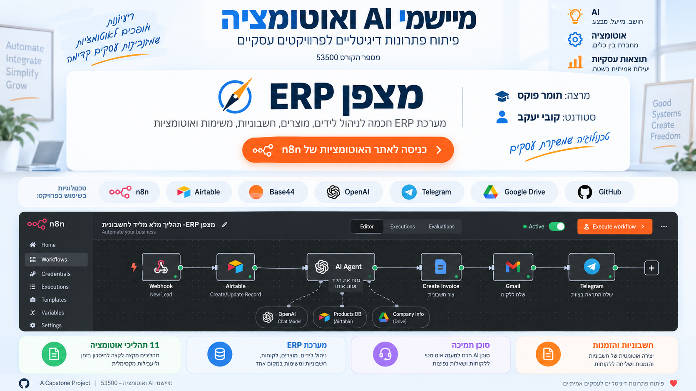
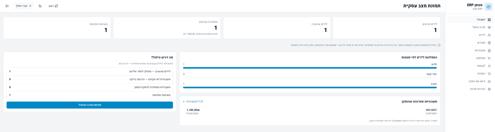

  

<h1 align="center">מצפן <bdi>ERP</bdi></h1>

מערכת לניהול עסק אלקטרוניקה, עם אוטומציות למכירות, לשירות ולהפקת מסמכים.

<h2 align="center">
  <a href="https://kobiyaacov.github.io/Kobi-ERP-AI-Automation/workflows/Kobi_ERP_Workflows.html">▶ צפייה ב־11 תהליכי האוטומציה</a>
</h2>

תצוגה אינטראקטיבית בסגנון n8n, עם רכיבים, חיבורים והגדרות.

  <a href="https://compass-erp-pilot.base44.app"><strong>פתיחת ממשק הניהול ב־Base44</strong></a>

  <strong>Base44 ↔ n8n ↔ Airtable</strong> 
  OpenAI · RAG · Telegram · Gmail · Google Drive

## מה המערכת עושה

**מכירות** · קליטת לידים ובדיקת כפילות, ניסוח מייל מכירה בעזרת AI, שליחה ב־Gmail ועדכון הסטטוס כשמגיעה תשובה.

**שירות לקוחות** · בוט בטלגרם עונה על שאלות בעזרת שני מאגרי RAG: מסמכי המדיניות וקטלוג המוצרים.

**ניהול ומסמכים** · הממשק מציג לקוחות, הזמנות, מוצרים ומשימות. מסלול החשבוניות בודק את הנתונים, מפיק מסמך HTML ושומר אותו ב־Google Drive.

   
  דשבורד המערכת ב־Base44. לחיצה על התמונה פותחת את הממשק.

## כלים למנהל

**סוכן המנהל (Flow 9)** קורא את טבלאות העסק ומשיב על שאלות ניהוליות. הוא אינו יוצר או משנה רשומות.

**מרכז הטיפול החכם (Flow 11)** שולח למנהל תקציר של פריטים שדורשים טיפול, עם הסיבה והצעת פעולה. האיתור מבוסס כללים; התהליך אינו משנה רשומות בעצמו.

## צפייה בפרויקט

1. פתחו את [ממשק הניהול ב־Base44](https://compass-erp-pilot.base44.app) כדי לראות את המערכת עצמה.
2. פתחו את סביבת האוטומציות מהקישור למעלה, והתחילו ב־Flow 5 לשירות, Flow 9 לניהול או Flow 11 לטיפול.
3. עברו לסיור המצולם כדי לראות את התוצאות בממשק, בבוטים וב־Drive.

## קבצים ותיעוד

[סיור מצולם](docs/presentation/README.md) · [11 תהליכי n8n](docs/workflows/WORKFLOWS.md) · [קובצי JSON](workflows/README.md) · [מקורות הידע של RAG](knowledge/README.md)

<strong>הערות על המימוש</strong>

זהו פרויקט לימודי. החשבוניות הן מסמכי דמו ב־HTML, לא PDF ואינן מיועדות לשימוש חשבונאי. הסטטוס `Issued` מציין שהמסמך הופק, לא שהתשלום התקבל.

אתר האוטומציות נועד לצפייה בלבד ואינו מפעיל את המערכת החיה. הגישה למערכת החיה מוגבלת למשתמש מורשה ואינה ניתנת דרך המאגר.

הצ׳אט ב־Base44 מסייע בהסברים ובניסוח ואינו קורא נתונים חיים. מאגר המוצרים של ה־RAG וטבלת המוצרים מנוהלים בנפרד.

הצילומים והבדיקות הידניות מתעדים תרחישי הדגמה, לא בדיקות אבטחה או עומסים. פרטי קשר הוסתרו בחלק מהתמונות.

קובצי ה־JSON יוצאו מ־n8n ונוקו מפרטי חיבור. פרסומם אינו מעיד שכל התהליכים הורצו מחדש אחרי הניקוי. הנחיות החיבור וההרצה מופיעות בתיקיית קובצי ה־JSON.

---

  <strong>קובי יעקב</strong> 
  פרויקט גמר · מיישמי AI ואוטומציה · 53500 
  ג׳ון ברייס · מרצה: תומר פוקס 
  הפרויקט נבנה בסיוע כלי AI.

