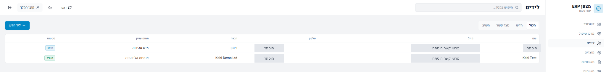
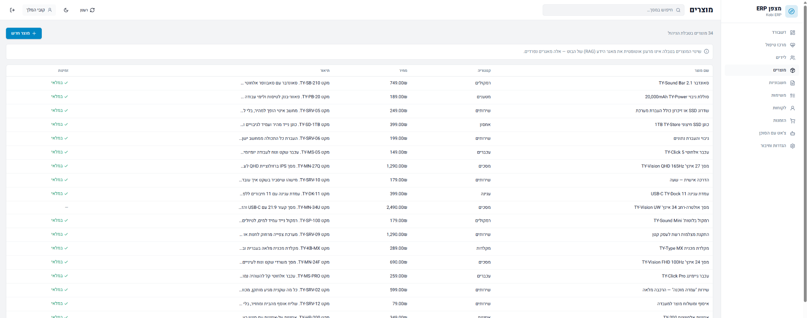
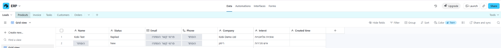
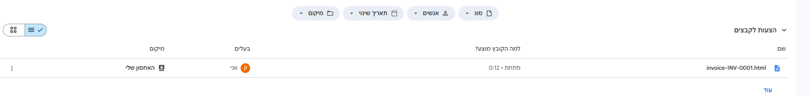
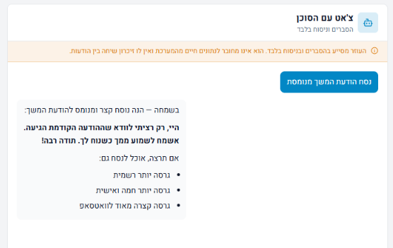

<a href="../../README.md">← חזרה לעמוד הפרויקט</a> · <a href="../workflows/WORKFLOWS.md">11 תהליכי האוטומציה</a>

# מצפן ERP | מהמסך לתוצאה

**סיור בארבע תחנות במערכת שנבנתה.** בכל תחנה מופיעים פעולה עסקית, החיבור הטכנולוגי שלה והתוצאה בצילום. התמונות נחתכו לשטח הרלוונטי; פרטי קשר הוסתרו. לחיצה על תמונה פותחת את הקובץ בגודל מלא.

<a href="#manage">01 · ניהול</a> &nbsp; / &nbsp; <a href="#knowledge">02 · ידע ושירות</a> &nbsp; / &nbsp; <a href="#documents">03 · מסמכים</a> &nbsp; / &nbsp; <a href="#decide">04 · טיפול</a>

---

## 01 · רואים את העסק ופועלים על הנתונים

**נקודת הכניסה של המנהל:** מצב הלידים, המשימות והמסמכים במקום אחד. רשימות וטפסים מאפשרים לעבור מתמונת המצב לניהול הרשומות.

<table>
<tr><th align="right">מה המנהל רואה</th><th align="right">מה קורה מאחורי המסך</th></tr>
<tr><td>לידים לפי סטטוס, משימות פתוחות וחשבונית שהופקה.</td><td>Base44 קורא נתונים דרך erpGateway ו־Flow 10, מתוך Airtable.</td></tr>
</table>

<strong>מהדשבורד לפרטים: לידים, קטלוג ומקור הנתונים</strong>

### לידים עם הקשר וסטטוס

שתי רשומות ההדגמה מציגות ליד חדש וליד שהשיב. פרטי הקשר הוסתרו בצילום; הסטטוסים והנתונים העסקיים נשמרו.

### קטלוג מוצרים

שמות, קטגוריות, מחירים וזמינות מוצגים בטבלת הניהול. הקטלוג ב־Airtable נפרד ממאגר הידע של בוט השירות.

### אותן רשומות, במקור הנתונים

צילום Airtable מציג את טבלת Leads ואת לשוניות שש הטבלאות. זו המחשה של שכבת הנתונים, לא מסד נפרד שהממשק יצר לעצמו.

---

## 02 · הידע של העסק הופך לשירות

**הלקוח שואל על החזרות, ואז על אוזניות.** בוט השירות הוא המקום שבו מסמכי המדיניות והקטלוג מקבלים ביטוי בשיחה.

<table>
<tr><th align="right">מקור הידע</th><th align="right">הכנה</th><th align="right">שימוש</th></tr>
<tr><td>מסמכי מדיניות + קטלוג מוצרים</td><td>Flows 3–4: טעינה למאגרי חיפוש</td><td>Flow 5: סוכן השירות בטלגרם</td></tr>
</table>

 תשובות מתוך שיחת ההדגמה. תוכן המדיניות מוצג כדוגמת ידע עסקי, לא כייעוץ משפטי.

**מה לומדים כאן:** אותו ערוץ שירות מטפל בשאלת מדיניות ובשאלת מוצר. מבנה החיבור למאגרי הידע מתועד בנפרד במפת התהליכים; צילום התשובה לבדו אינו יומן של קריאות הכלים.

---

## 03 · מרשומה עסקית למסמך שנשמר

**Flow 7 בודק את נתוני החשבונית; Flow 8 מפיק את המסמך ושומר אותו ב־Drive.** בממשק נשמרים הסכומים, סטטוס ההפקה וקישור לפתיחה.

<table>
<tr><th align="center">לפני מע״מ</th><th align="center">מע״מ בדוגמה</th><th align="center">סך הכול</th><th align="center">תוצאה</th></tr>
<tr><td align="center">1,000 ₪</td><td align="center">180 ₪</td><td align="center">1,180 ₪</td><td align="center">מסמך דמו שהופק</td></tr>
</table>

<strong>הקובץ בצד השני של הקישור: Google Drive</strong>

השם `invoice-INV-0001.html` מופיע בדרייב. הפלט בגרסה הזו הוא **HTML**, והסטטוס **Issued אינו מעיד שהתקבל תשלום**.

---

## 04 · ממידע לפריט שדורש טיפול

**התוספת האישית, Flow 11:** תקציר יזום לבוט המנהל. בדוגמה מופיעים הליד שהשיב, הסיבה להתראה והצעת הפעולה. ההחלטה והביצוע נשארים אצל המנהל.

<strong>כלי משלים: עוזר ניסוח בתוך האפליקציה</strong>

הצ׳אט הפנימי מסייע בהסברים ובכתיבה. בדוגמה מתבקשת הודעת המשך מנומסת. הוא **אינו** אותו סוכן כמו בוט המנהל ואינו קורא את הנתונים החיים.

---

**הסיפור המלא:** נתונים נשמרים, תהליכים פועלים עליהם, מסמכים ותשובות נוצרים, והמנהל מקבל תמונת מצב והצעות לטיפול.

<a href="../../README.md"><strong>חזרה לסיכום הפרויקט</strong></a> · <a href="../workflows/WORKFLOWS.md"><strong>איך זה עובד ב־n8n?</strong></a>

