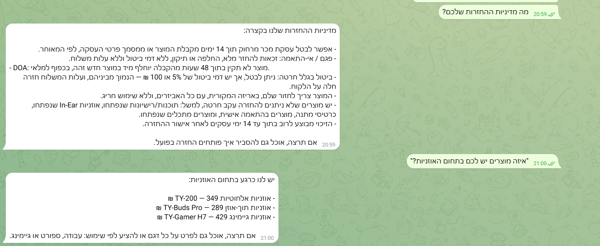
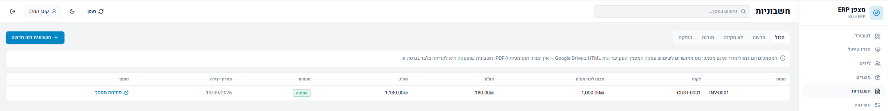

<a href="../../README.md">← חזרה לעמוד הפרויקט</a> · <a href="../presentation/README.md">סיור מצולם במערכת</a>

# 11 תהליכי n8n · מצפן ERP

**הלב האוטומטי של המערכת.**  
כל Flow אחראי על פעולה אחת ברורה, והחיבור ביניהם נעשה דרך Airtable, Gmail, Telegram, Google Drive ומאגרי הידע.

<code>Lead → Sale → Reply → Treatment</code> &nbsp; · &nbsp; <code>Policy / Products → RAG → Support</code> &nbsp; · &nbsp; <code>Invoice → Validate → Drive</code>

---

## שלושה מסלולים שמספרים את הפרויקט

<table>
<tr>
<td width="33%" valign="top">

### 01 · מכירות ומעקב

**Flow 1**  
קליטת ליד ובדיקת כפילות.

↓  

**Flow 2**  
ניסוח ושליחת מייל מכירה.

↓  

**Flow 6**  
זיהוי תשובת הלקוח.

↓  

**Flow 11**  
הצפת הפריט למנהל לטיפול.

</td>
<td width="33%" valign="top">

### 02 · ידע ושירות

**Flow 3**  
טעינת מדיניות העסק.

**Flow 4**  
טעינת קטלוג המוצרים.

↓  

**Flow 5**  
סוכן שירות הלקוחות נעזר בשני מאגרי הידע ועונה בטלגרם.

</td>
<td width="33%" valign="top">

### 03 · חשבוניות

**Flow 7**  
אימות נתונים, מע״מ ומספור.

↓  

**Flow 8**  
יצירת מסמך HTML ושמירה ב־Google Drive.

↓  

הקישור חוזר לרשומה ולממשק.

</td>
</tr>
</table>

---

## כל 11 התהליכים

| Flow | תהליך | טריגר | תוצאה |
| :---: | :--- | :--- | :--- |
| **01** | קליטת לידים | Webhook עם פרטי ליד | ליד חדש ב־`New`, לאחר בדיקת כפילות לפי אימייל |
| **02** | מיילי מכירות | כל 3 שעות | מייל AI דרך Gmail + סטטוס `Contacted` |
| **03** | מאגר המדיניות | העלאת מסמך | מדיניות העסק זמינה לחיפוש סמנטי |
| **04** | מאגר המוצרים | העלאת CSV | קטלוג המוצרים זמין לחיפוש סמנטי |
| **05** | סוכן שירות לקוחות | הודעה לבוט Telegram | תשובה המבוססת על מדיניות או מוצרים |
| **06** | מעקב אחר תגובות | כל 30 דקות | ליד מתאים מסומן `Replied` |
| **07** | אימות חשבוניות | חשבונית חדשה | `Ready` להפקה או `Invalid` לבדיקה |
| **08** | הפקת מסמך | חשבונית `Ready` | קובץ ב־Drive + קישור + `Issued` |
| **09** | סוכן המנהל | הודעת Telegram מבעל העסק | תשובה ניהולית המבוססת על נתוני המערכת |
| **10** | App API | בקשה מ־Base44 | `read` / `create` / `update` / `chat` |
| **11** | מרכז הטיפול החכם | כל שעה | תקציר פריטים שדורשים טיפול למנהל |

---

## 04 · שכבת הניהול

### Flow 9 · סוכן המנהל
בוט Telegram המוגבל למשתמש המורשה. הסוכן יכול לקרוא מידע מ־Leads, Invoice, Products ו־Tasks ולנסח תשובה ניהולית.

### Flow 10 · החיבור לממשק
שער אחד בין Base44 ל־n8n. הממשק שולח פעולה וטבלה, ו־Flow 10 מבצע את הקריאה או הכתיבה המתאימה. מסלול `chat` משמש לעוזר שבתוך האפליקציה.

### Flow 11 · התוספת האישית
מרכז טיפול יזום שמחפש:
- לידים שחזרו אלינו
- משימות פתוחות
- חשבוניות לא תקינות
- חשבוניות שממתינות למסמך

התהליך שולח תקציר אחד למנהל עם **הסיבה לטיפול והפעולה המומלצת**, אך אינו משנה רשומות בעצמו. ההחלטה נשארת אצל האדם.

---

<strong>איך RAG נכנס לפרויקט?</strong>

Flows **3–4** מכינים שני מאגרי ידע נפרדים:

- **Policies** → שעות פעילות, משלוחים, החזרות, אחריות ומדיניות עסקית.
- **Products** → שמות מוצרים, תיאורים, קטגוריות ומחירים.

Flow **5** הוא סוכן שירות הלקוחות. כאשר נשאלת שאלה, הוא משתמש במאגר המתאים כדי לענות על בסיס המידע של העסק.

<strong>איך מסלול החשבונית עובד?</strong>

**Flow 7** בודק שהחשבונית כוללת סכום ומזהה לקוח תקינים, מחשב מע״מ ומספר מסמך ומעביר אותה ל־`Ready`.

**Flow 8** בונה מסמך HTML, מעלה אותו ל־Google Drive ושומר את הקישור ברשומה.

---

### הערה להצגה
זהו תיעוד של המערכת שנבנתה והודגמה במהלך הפרויקט. פרטי התחברות, Tokens ו־Secrets אינם חלק מהמאגר הציבורי.

<strong>קובי יעקב · מצפן ERP</strong> n8n · Airtable · Base44 · OpenAI · Telegram · Gmail · Google Drive

